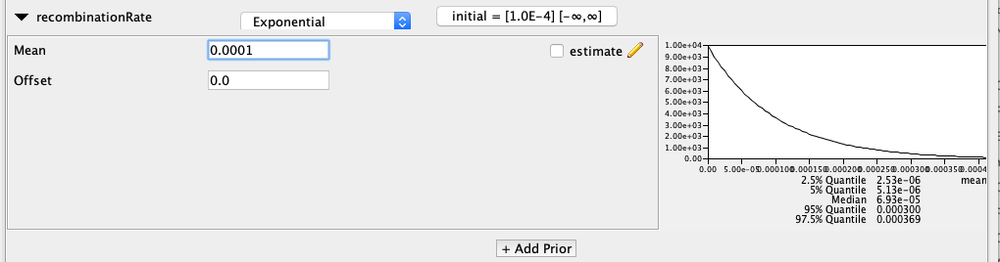

# Background

Phylogenetic trees are often used to describe the history of genetic sequences.
This relatedness of genetic sequences can be used to learn how e.g. pathogens isoalted from different individuals are related, which tells us somethings about the transmission history.
Recombination breaks the central assumption that this relatedness can be represented by a tree and requires it to be denoted by a network instead.

The coalescent with recombination models a joint coalescent and recombination process .
To do so, it models how network lineages coalesce and recombine backwards in time. 
This is the backwards in time equivalent of the template switching model of recombination upon coninfection, where one such event occurs per coinfection event.

In order to perform inference under the coalescent with recombination, the Recombination package uses MCMC sampling of recombination networks and how local trees, i.e. trees at individual nucleotide positions, are embedded within those networks.
The way the Recombination package is implemented, allows following the usual setup for BEAST2 xml files in BEAUti.

After running a coalescent with recombination analysis, the post-processing works slightly different to other models.
Since we have to analyse a network and not just a tree, the Recombination package implements a BEAST2 app that summarizes networks and works similar to treeAnnotator.

----

# Programs used in this Exercise

### BEAST2 - Bayesian Evolutionary Analysis Sampling Trees 2

BEAST2 ([http://www.beast2.org](http://www.beast2.org)) is a free software package for Bayesian evolutionary analysis of molecular sequences using MCMC and strictly oriented toward inference using rooted, time-measured phylogenetic trees. This tutorial is written for BEAST v{{ page.beastversion }} .

### BEAUti2 - Bayesian Evolutionary Analysis Utility

BEAUti2 is a graphical user interface tool for generating BEAST2 XML configuration files.

Both BEAST2 and BEAUti2 are Java programs, which means that the exact same code runs on all platforms. For us it simply means that the interface will be the same on all platforms. The screenshots used in this tutorial are taken on a Mac OS X computer; however, both programs will have the same layout and functionality on both Windows and Linux. BEAUti2 is provided as a part of the BEAST2 package so you do not need to install it separately.

### IcyTree.org

IcyTree.org is a webbased tree viewer that, additional to trees, also allows to visualize networks in the extended newick format.

----

# Practical: Setting up an coalescent with recombination analysis

The coalescent with recombination is an approach that allows inferring recombination networks and recombination rates  from multiple sequence alignments.
It therby assumes that the recombination process can be modeled such that everything on one side of a breakpoint originates from one parent lineage and everything else from the other parent lineage.

In this tutorial, we will learn how to create an xml for a coalescent with recombination analysis, how to then run this xml, as well as how to process and visualize the output of such an analysis.

## The Data

The data consists of sequences of the nucleocapsid protein of one of the seasonal human coronaviruses called 229e.
The nucleocapsid protein is a structural protein of cornaviruses.

Overall, the dataset we use in this tutorial consists of 25 sequences of the nucleocapsid protein of 229e viruses sampled over several years [https://www.viprbrc.org/](https://www.viprbrc.org/).
The sequences are already aligned and can be found in the data folder.

## Download CoalRe
First, we have to download the CoalRe package, using the BEAUti package manager.
To do so, open BEAUTi and then go to `File >> Manage Packages` and download the Recombination package .

<figure>
	
	
	<figcaption>Figure 1: Download the Recombination package</figcaption>
</figure>

After the package is installed, re-start BEAUti.

## Load in the sequences
In order to load in the sequences into BEAUti, they can be dragged and dropped into the partitions window.
Then a window will pop up, where we'll have to specify that all the sequence files just loaded in are nucleotide sequences.
This is so BEAUti knows which site models to suggest.

<figure>
	
	
	<figcaption>Figure 2: Drag and drop the sequence files into the partitions window.</figcaption>
</figure>

While often done for such analysis, the Recombination package can at the moment not account for rate variations across different sites.
We have therfore nothing left to do in this panel and can move on to setting the sampling times.

## Setting up the sampling times
Next, we'll have to set up the sampling times.
To do so, go to `Tip Dates`  and select `Use tip dates`
Specify the dates format to be `yyyy-M-dd` and press the `Auto-configure` button.
In the window that should pop up, select split on character

<figure>
	
	
	<figcaption>Figure 4: Split character and take the last group to get the sampling times .</figcaption>
</figure>

## Setting up the site model
As a site model, we will use an $HKY+\Gamma_4$ model.
To do so, first set the site model from `JC69` to `HKY`, which allows transition and transversion rates to differ.
Next, set the `Gamma Category Count` to 4 and make sure to click `estimate` for the `Substitution Rate`.
Setting the `Gamma Category Count` to 4 uses a discretized version of a gamma distribution to model different rate categories across sites.
4 or 5 different categories has been shown to be a good compromise between computational efficiency and still being able to approximate the gamma distribution well enough in practice.
Clicking `estimate` for the `Substitution Rate` allows each segment, as well as the first two and the third codon position to have a different relative rate of evolution.

<figure>
	
	
	<figcaption>Figure 6: Setting up the site models tp an $HKY+\Gamma_4$ model.</figcaption>
</figure>

## Setting up the Priors
We can leave the clock model as is, which means that we use a `Strict Clock Model` (default) and can directly go the the `Priors` tab.
The first and most important thing we have to do here, is to to change the `Yule Model` to `Coalescent With Recombination Constant Population`.

<figure>
	
	
	<figcaption>Figure 8: Changing the Yule model to the coalescent with recombination model.</figcaption>
</figure>

We next have to set the prior distribution on the parameters.
The prior distribution on the effective population size can be left as is, but we have to change the prior on the recombination rate.
Set the prior distribution on the reassortment rate to be an exponential distribution with mean 0.0001.
This means that we assume a priori that on average there is one recombination event between every pair of adjecent positions in the alignment occur every 1000 years.
Since our alignment has 1170 nucleotides, we expect one event to occur on a lineage every 1000/(1170-1) years.

<figure>
	
	
	<figcaption>Figure 9: Setting the prior distribution on the recombination rate.</figcaption>
</figure>

## Setting up the Chain Length
Next, we can go to the `MCMC` panel to set the chain length. 
For this analysis that doesn't describe a too complex recombination network, a chain length of 10 million should be enough.
This was the last step of setting up the xml and we can now save it by going to `File > Save as`

<figure>
	
	
	<figcaption>Figure 10: Save xml.</figcaption>
</figure>

## Run the xml
Next, open `BEAST` and run the xml.
This should take somewhere in the order of 40 to 60 minutes.
Alternative, the folder `precooked_runs` contains the log files of the run.

## Inspect the run in Tracer
Next, we have to check whether everything converged.
To do so, we can open the program Tracer and load the `*.log` file.
All ESS values should optimally be above 200.

<figure>
	
	
	<figcaption>Figure 11: Check convergence in Tracer.</figcaption>
</figure>

Next, we can check what rates were inferred.
The `clockRate` denotes the average rate of evolution across all segments.
The `recombinationRate` denotes the rate of recombination (from present to past) per lineage and year betwenn adjecent positions in the genome.

## Summarize the posterior distribution of networks
Next, we can summarize the distribution of networks by maximizing the clade credibilities.
To do so, open `BEAUti` and select `File > Launch Apps`.
Then, select `Recombination Network Annotator`.

Next, choose the `229e_nucelocapsid.networks.trees` file as input for the `Recombination Network log file` and choose the file where the mcc network should be saved to and press analyse.

<figure>
	
	
	<figcaption>Figure 12: Produce the maximum clade credibility network.</figcaption>
</figure>

## Visualize the network using icytree.org
Next, open your browser and go to the webpage [icytree.org](icytree.org)
The resulting mcc network file can now be drag and dropped into icytree to visualize the network.
Icytree plots the network as a base tree that is connected by dotted branches.
This implies that at a recombination event, there is a difference between the two parent branches.
This is, however, not the case in this coalescent with recombination model, but for simplicity is plotted like this.
The "main" branch here is the always the parent branch that carries more genetic material, in the sense that more of it's genetic material is sampled in the future and therefore shows up the network.

<figure>
	
	
	<figcaption>Figure 13: Visualize the mcc network in icytree.</figcaption>
</figure>

The 95 $\%$ highest posterior density intervals for node heights can be plotted by going to `Style > Node height error bars`.
The posterior support for each node can be shown by going to `Style > Internal node text`.

----

# Useful Links

- BEAST 2 website and documentation: [http://www.beast2.org/](http://www.beast2.org/)
- Join the BEAST user discussion: [http://groups.google.com/group/beast-users](http://groups.google.com/group/beast-users)

----

# Relevant References


